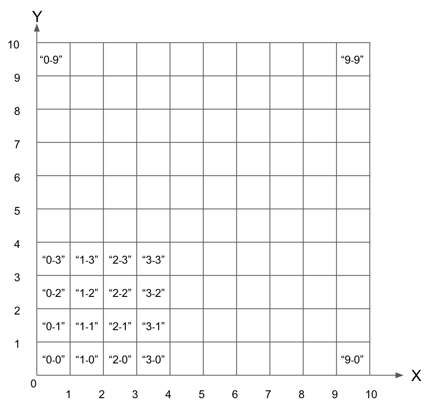

# Siametrics Backend Testing

## Algorithm Testing
##### 1. What is Big(O) of this function, and show how to calculate
```
function search(array, item) {
    let minIndex = 0;
    let maxIndex = array.length - 1;
    let currentIndex;
    let currentElement;

    while (minIndex <= maxIndex) {
        currentIndex = Math.floor((minIndex + maxIndex) / 2);
        currentElement = array[currentIndex];

        if (currentElement < item) {
            minIndex = currentIndex + 1;
        }
        else if (currentElement > item) {
            maxIndex = currentIndex - 1;
        }
        else {
            return currentIndex;
        }
    }
    return -1;
}
```
##### 2. Write an algolithm to solve this question
Imagine a grid of size 10x10 with a total of 100 boxes 

Each box has a label attached to it, starting with “0-0” as the box on the most bottom left, “1-0” as the box to the right of “0-0” and “0-1” as the box to the top of “0-0” as shown in figure 1. 

A QxQ box set collection is defined as a list of Q*Q box set starting from the most bottom left of the grid. For example, a 2x2 box collection includes {“0-0”, “1-0”, “0-1”, “1-1”}, {“2-1”, “3-1”, “2-0”, “3-0”}, {“0-2”,”0-3”,”1-2”,”1-3”}, and so on to cover the entire grid. The smallest possible Q value is 1.

The centroid of a box set is defined as the center coordinate of the boxes in the set. For example, the centroid of box set with a single box “1-0” is (1.5,0.5). The centroid of {“0-0”, “1-0”, “0-1”, “1-1”} is (1,1). The centroid of {“0-0”, “1-0”, “2-0”, “0-1”, “1-1”, “2-1”, “0-2”, “1-2”, “2-2”} is (1.5,1.5). 


  Figure 1

##### Task:

Write a python function that accepts 2 parameters:
1. Grid size (G) - If G is 100, then we are dealing with a 100x100 grid
2. Box set dimension (D) - This is the dimension of the box set. If D is 2, then we are dealing with a list of 2x2 Box Set

Based on the input parameters, your python function will compute f(p,q) = p*p+q for each of the individual G*G boxes in the grid where p and q are the centroid coordinate of each box’s corresponding box set. The output of the python function will be a python dictionary with a set of box names and their corresponding f(p,q) values.

For example, if G is 10 and if D is 2, we are considering a 10x10 grid and 2x2 box set. In this case, each of boxes “0-2”, “0-3”, “1-2”, “1-3” will have p = 1, q = 3, since the centroid of {“0-2”, “0-3”, “1-2”, “1-3”} is (1,3). Also since G is 10, the function will have to compute the f(p,q) values for all the 10*10=100 boxes.

If G is not divisible by D, then your function can return -1.

## SQL Testing
##### 1. Write a SQL query to get the second highest salary for each department from the Employee and Department table.
```
Employee Table
+----+--------+ -------------+
| Id | Salary | DepartmentId |
+----+--------+ -------------+
| 1  | 100    |       1      |
| 2  | 200    |       1      |
| 3  | 300    |       2      |
| 4  | 400    |       2      |
+----+--------+--------------+

Department Table
+----+--------+ ----+
| Id | Name         |
+----+--------+ ----+
| 1  | Finance      |
| 2  | Development  |
+----+--------+-----+
```
For example, given the above Employee table, the query should return 200 as the second highest salary. If there is no second highest salary, then the query should return null.
```
Output
+---------------------+--------+
| Department Name     | Salary |
+---------------------+--------+
| Finance             | 100    |
| Development         | 300    |
+---------------------+--------+
```
